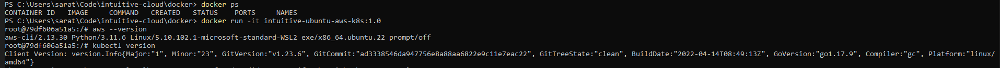

# Dockerfile Exercise

## Steps

### 1. Building the Docker Image

```shell
docker build -t intuitive-ubuntu-aws-k8s:1.0 .
```


### 2. List the containers running

```shell
docker image ls
```


### 3. Run the container locally

```shell
docker run -it intuitive-ubuntu-aws-k8s:1.0
```


### 4. Verify dependency installation on container

```shell
apt list --installed | grep -e "^curl/" -e "^iproute2/" -e "^sshfs/" -e "^unzip/" -e "^less/" -e "^groff/"
```


### 5. Tag the Container and Push it to DockerHub registry

```shell
docker tag intuitive-ubuntu-aws-k8s:1.0 saratrajan/intuitive-ubuntu-aws-k8s:1.0
docker push saratrajan/intuitive-ubuntu-aws-k8s:1.0
```
