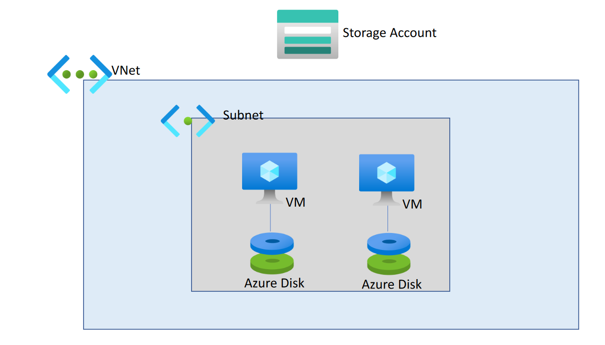

# Terraform Exercise

## Azure Architecture

Below is the architecture diagram that has been used to formulate the Terraform components and modules.



## Directory Structure

```shell
main_project_directory/
│
├── main.tf
├── provider.tf
│
├── modules/
│   │
│   ├── compute/
│   │   ├── main.tf
│   │   ├── variables.tf
│   │   ├── outputs.tf
│   │
│   ├── storage/
│   │   ├── main.tf
│   │   ├── variables.tf
│   │   ├── outputs.tf
│   │
│   └── networking/
│       ├── main.tf
│       ├── variables.tf
│       └── outputs.tf

```

